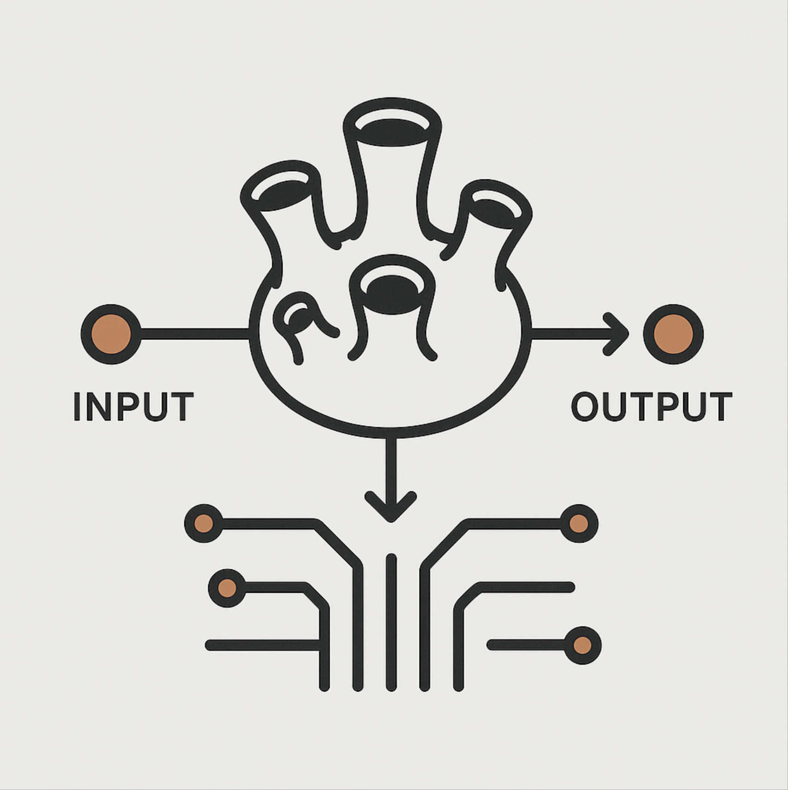

<div align="center">
  
</div>

# Barnacle 🦀

[](https://crates.io/crates/barnacle-rs)
[](https://docs.rs/barnacle-rs)
[](https://github.com/zyphelabs/barnacle-rs/blob/main/LICENSE)
[](https://www.rust-lang.org)

Rate limiting middleware for Axum with Redis backend and API key validation.

[Repository](https://github.com/zyphelabs/barnacle-rs) | [Documentation](https://docs.rs/barnacle-rs) | [Crates.io](https://crates.io/crates/barnacle-rs)

## Features

- **Rate Limiting**: IP-based or custom key-based rate limiting
- **API Key Validation**: Validate `x-api-key` header with per-key limits
- **Redis Backend**: Distributed rate limiting with Redis
- **Axum Middleware**: Drop-in middleware for Axum applications
- **Reset on Success**: Optional rate limit reset on successful operations
- **Extensible Design**: Custom key stores and rate limiting strategies

## Quick Start

```toml
[dependencies]
barnacle-rs = "0.1.0"
axum = "0.8"
tokio = { version = "1", features = ["full"] }
```

### Basic Rate Limiting

```rust
use barnacle_rs::{create_barnacle_layer, RedisBarnacleStore, BarnacleConfig};
use axum::{Router, routing::get};

#[tokio::main]
async fn main() -> Result<(), Box<dyn std::error::Error>> {
    let store = RedisBarnacleStore::from_url("redis://127.0.0.1:6379").await?;
    
    let config = BarnacleConfig {
        max_requests: 10,
        window: std::time::Duration::from_secs(60),
        reset_on_success: barnacle_rs::ResetOnSuccess::Not,
    };

    let rate_limiter = create_barnacle_layer(store, config);

    let app = Router::new()
        .route("/api/data", get(handler))
        .layer(rate_limiter);

    let listener = tokio::net::TcpListener::bind("0.0.0.0:3000").await?;
    axum::serve(listener, app).await?;
    Ok(())
}

async fn handler() -> &'static str {
    "Hello, World!"
}
```

### API Key Validation

```rust
use barnacle_rs::{create_api_key_layer, RedisApiKeyStore, RedisBarnacleStore};

#[tokio::main]
async fn main() -> Result<(), Box<dyn std::error::Error>> {
    let redis_pool = deadpool_redis::Config::from_url("redis://localhost")
        .create_pool(Some(deadpool_redis::Runtime::Tokio1))?;

    let api_key_store = RedisApiKeyStore::new(redis_pool.clone(), BarnacleConfig::default());
    let rate_limit_store = RedisBarnacleStore::new(redis_pool);

    let middleware = create_api_key_layer(api_key_store, rate_limit_store);

    let app = Router::new()
        .route("/api/protected", get(protected_handler))
        .layer(middleware);

    let listener = tokio::net::TcpListener::bind("0.0.0.0:3000").await?;
    axum::serve(listener, app).await?;
    Ok(())
}

async fn protected_handler() -> &'static str {
    "Protected endpoint"
}
```

## Configuration

```rust
let config = BarnacleConfig {
    max_requests: 100,                              // Requests per window
    window: Duration::from_secs(3600),              // Time window
    reset_on_success: ResetOnSuccess::Yes(          // Reset on success
        Some(vec![200, 201])                        // Status codes to reset on
    ),
};
```

## Rate Limiting Strategies

### IP-based (default)

```rust
let limiter = create_barnacle_layer(store, config);
```

### API Key-based

```rust
let limiter = create_api_key_layer(api_key_store, rate_limit_store);
```

### Custom Key (e.g., email)

```rust
use barnacle_rs::{KeyExtractable, BarnacleKey};

#[derive(serde::Deserialize)]
struct LoginRequest {
    email: String,
    password: String,
}

impl KeyExtractable for LoginRequest {
    fn extract_key(&self) -> BarnacleKey {
        BarnacleKey::Email(self.email.clone())
    }
}

let limiter = create_barnacle_layer_for_payload::<LoginRequest>(store, config);
```

## Redis Setup

Store API keys in Redis:

```bash
# Valid API key
redis-cli SET "barnacle:api_keys:your-key" 1

# Per-key rate limit config
redis-cli SET "barnacle:api_keys:config:your-key" '{"max_requests":100,"window":3600,"reset_on_success":"Not"}'
```

## Examples

```bash
# Run examples
cargo run --example basic
cargo run --example api_key_redis_test
```

## License

MIT

## Contributing

Contributions are welcome! Please feel free to submit a Pull Request.
